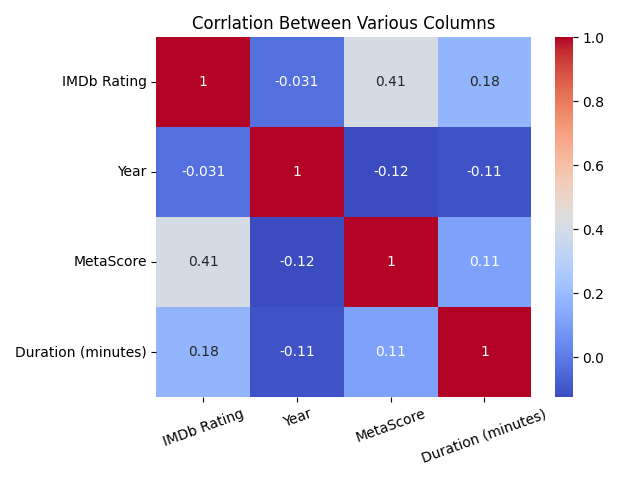

# IMDb Ratings Data Analysis

This repository contains a detailed analysis of IMDb ratings data. The analysis explores various aspects of movie ratings, genres, and other attributes, providing insights into trends and patterns in the movie industry.

## Key Findings

1. **Strong Correlation**: There is a strong correlation between IMDb ratings and MetaScores.
2. **Common Genres**: The most common genres are Biography, Action, Drama, and Documentary.
3. **High-Rated Genres**: High-rated genres include Documentary, Animation, and Biography.
4. **Stable Ratings**: Movie ratings have been more stable in the current decade compared to the past.
5. **Certificate Analysis**: Movies with a Restricted certificate are the most frequent, while ratings for TV-14 and Approved certificates are higher.
6. **Top Directors**: Directors Andrew Kent and Steven Scaffidi have movies with high ratings.
7. **Release Trends**: The number of movies released increased year by year until it suddenly dropped after 2018.

## Analysis Summary

The analysis includes the following steps:

1. **Data Loading and Cleaning**:
    - Imported the dataset and performed initial exploration.
    - Removed unnecessary columns and handled missing values.
    - Removed duplicate entries to ensure data accuracy.

2. **Exploratory Data Analysis (EDA)**:
    - Analyzed the distribution of IMDb ratings.
    - Investigated the relationship between genres and movie ratings.
    - Explored trends in movie releases over the years.
    - Examined the correlation between IMDb ratings and MetaScores.
    - Visualized the relationship between release year and movie duration.

3. **Visualizations**:
    - Count plots and bar plots to show movie counts and median ratings by genre.
    - Histograms to illustrate the distribution of IMDb ratings.
    - Line plots to reveal trends in movie releases and durations.
    - Scatter plots and correlation heatmaps to highlight relationships between numerical features.

## Visualizations

Some of the visualizations included in the analysis:

- **Movie Counts by Genre**:
    

- **Median Ratings by Genre**:
    

- **Distribution of IMDb Ratings**:
    

- **Number of Movies Released Every Year**:
    

- **Correlation Heatmap**:
    

## How to Run the Notebook

1. Clone this repository to your local machine.
2. Ensure you have the required Python libraries installed:
    - `pandas`
    - `matplotlib`
    - `seaborn`
    - `scikit-learn`
3. Open the `imdb_rating_data_analysis.ipynb` notebook and run the cells to reproduce the analysis.

## Conclusion

This analysis provides valuable insights into the IMDb ratings dataset, highlighting key trends and patterns in the movie industry. The findings can be useful for movie enthusiasts, researchers, and industry professionals looking to understand the factors influencing movie ratings and releases.

---

Feel free to explore the notebook and the visualizations to gain a deeper understanding of the IMDb ratings data. Contributions and suggestions are welcome!

